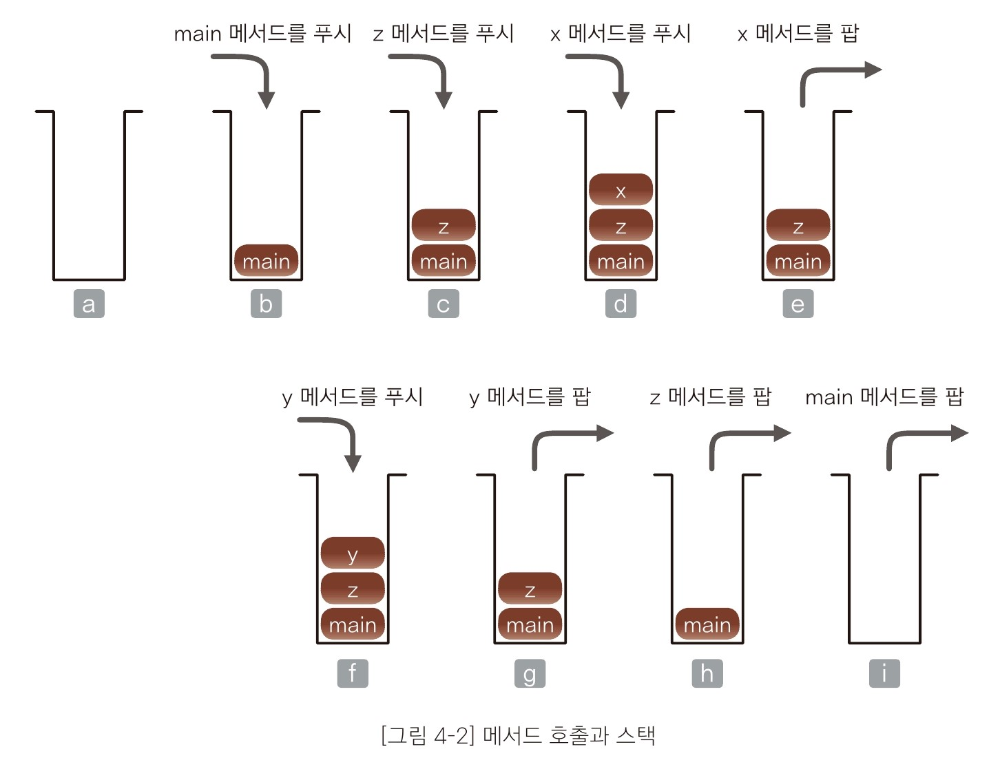

## 4-1. 스택
### 스택(stack)이란?
스택은 데이터를 일시적으로 저장하기 위해 사용하는 자료구조로, 데이터의 입력과
출력 순서는 후입선출(LIFO, Last In First Out)이다. 이는 가장 나중에 넣은
데이터를 가장 먼저 꺼낸다는 것을 의미한다. Java 프로그램에서 메서드를 호출하고
실행할 때 프로그램 내부에서는 스택을 사용한다.

#### 용어
- 푸시 : 스택에 데이터를 넣는 작업('쌓기'라고도 한다)
- 팝 : 스택에서 데이터를 꺼내는 작업
- 꼭대기(top) : 푸시와 팝을 하는 위치
- 바닥(bottom) : 스택의 가장 아랫부분
---
메소드의 호출과 실행 과정을 살펴보자.
```
void x() {/*...*/}

void y() {/*...*/}

void z(){
    x();
    y();
}

int main() {
    z();
}
```
위 코드가 동작하는 순서는 다음과 같다.
1. main 메서드가 실행되기 전의 상태입니다.
2. main 메서드를 실행합니다. (main 메서드를 푸시)
3. z 메서드를 호출합니다.
4. x 메서드를 호출합니다.
5. x 메서드가 실행을 종료하고 z 메서드로 돌아옵니다.
6. y 메서드를 호출합니다.
7. y 메서드가 실행을 종료하고 z 메서드로 돌아옵니다.
8. z 메서드가 실행을 종료하고 main 메서드로 돌아옵니다.
9. main 메서드가 실행을 종료합니다.

<p align="center">

</p>

